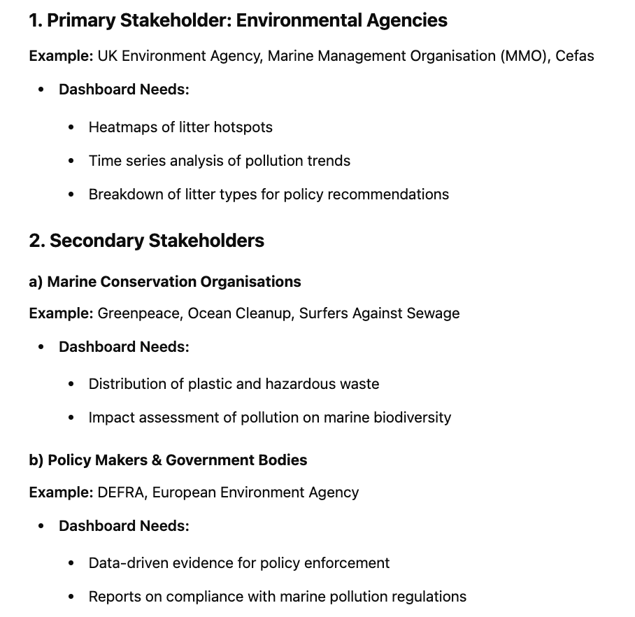
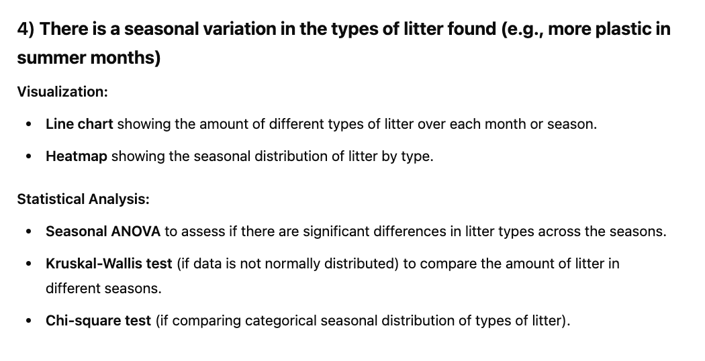
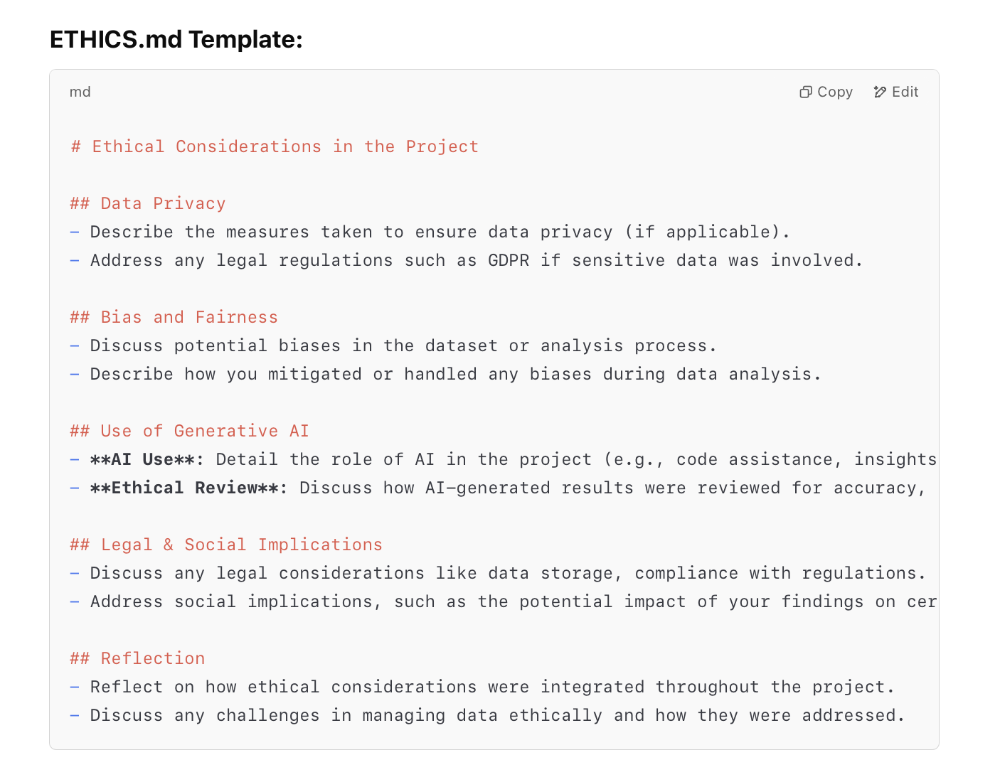

# Use of Generative AI in This Project

## Introduction
Generative AI tools, including OpenAI's GPT models and GitHub Copilot were used to help with various different parts of the project. These tools were incredibly helpful for the ideation process, writing documentation, and helping me to design the dashboard.

## Applications of AI

### Documentation
- AI tools were used extensively throughout various sections of the documentation. The time saved, by doing so, allowed me to efficiently use my limited time on other aspects of the project.

### Code Assistance
- Detail instances where AI helped with code generation, debugging, or suggestions (e.g., cleaning data, generating statistical plots).  

### Insights Generation

- Under business requirements, I used AI to generate a list of stakeholders.

    Prompt used:

        I am working on a data analysis project on marine seafloor litter, focusing on pollution trends in the North East Atlantic. Please provide a structured list of stakeholders.

    AI Output:

     

- Under the hypotheses and validation methods section in the README.md file, I utilised AI to suggest the most suitable visualisations and statistical tests for validating my hypotheses. 

    Prompt used: 

        Based on my hypotheses below, please tell me what visualisations are best suited to test them, and the validation methods I could use to statistically analyse these results.

        Hypotheses: 
        1. Plastic is the highest category of litter.

        2. Litter accumulation varies significantly between the Celtic and Greater North Sea areas.

        3. There is a positive correlation between the distance of the haul and the total amount of litter found.

        4.  There is a seasonal variation in the types of litter found.

        5. Coastal areas with higher fishing activity have higher amounts of fishing-related debris.	

    AI output:

     

- For the templates of this file and the ethics file, I used ChatGPT to generate templates for me to fill in.

     Prompt used:

        Please generate me documentation templates, in markdown, for generative AI and ethics.

        Gen ai: intro, applications> documentation, coding help, business req. , data insights, design thinking, how i made sure outputs were correct, pros and cons of AI

        Ethics: data+privacy, bias, legal issues, reflection

    AI Output:

    

### Design Thinking
AI helped me think through the design of the dashboard. It gave suggestions on what types of charts and graphs would be most helpful for the stakeholders. For example, GPT recommended using heatmaps and bar graphs to show trends in marine litter over time. It also helped me refine the business requirements and think about what stakeholders would need from the dashboard.

## Ethical Review of AI Use
- Ensure that AI-generated outputs were validated and verified by the team to maintain transparency and accuracy.

## Benefits and Limitations
**Benefits:**
- AI reduced the time required for documentation editing, allowing more focus on the analysis sections.

**Limitations:**
- Some AI suggestions required editing to provide more context, it sometimes generated responses without sticking to the defined constraints of the data I had provided. 