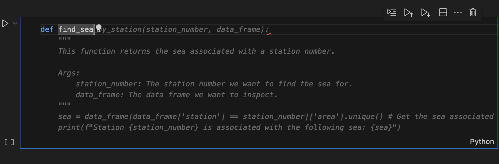
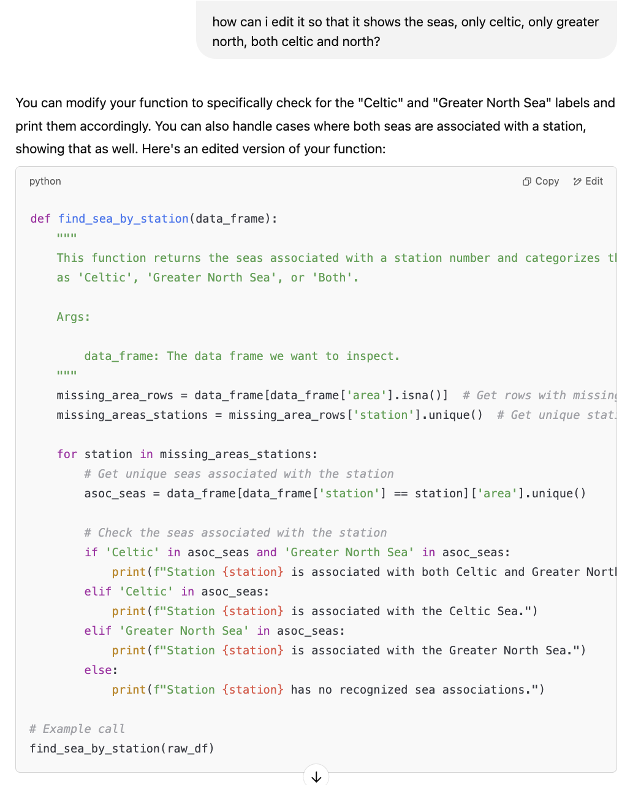

# Use of Generative AI in This Project

## Introduction

Generative AI tools, including OpenAI's GPT models and GitHub Copilot, were used to assist with various aspects of this project. These tools were particularly valuable for brainstorming, documentation, and dashboard design.

## Applications of AI

### Documentation

* AI tools were used extensively throughout the documentation. This saved time, allowing for more focus on other project aspects.
* **Template Generation:**
    * AI was used to generate markdown documentation templates for generative AI and ethics.
    * Prompt: "Please generate me documentation templates, in markdown, for generative AI and ethics. Gen ai: intro, applications> documentation, coding help, business req. , data insights, design thinking, how i made sure outputs were correct, pros and cons of AI. Ethics: data+privacy, bias, legal issues, reflection"
    * Output:
        *  

### Code Assistance

* AI assisted with code generation, debugging, and suggestions, specifically in:
    * Data cleaning.
    * Generating statistical plots.
    * **Imputation Function:**
        * For Notebook 01, section 1.3 (data cleaning), an imputation function was initially autogenerated using GitHub Copilot from the markdown explanation for the steps I wanted to.
        * To optimise the function to show only the associated sea, ChatGPT was then used.
    * Output - Copilot Function:
        *  
    * Output - Optimised ChatGPT:
        *  

### Insights Generation

* **Stakeholder Identification:**
    * AI was used to generate a list of stakeholders based on the project's focus on marine seafloor litter in the North East Atlantic.
    * Prompt: "I am working on a data analysis project on marine seafloor litter, focusing on pollution trends in the North East Atlantic. Please provide a structured list of stakeholders."
    * Output:
        *  
* **Hypothesis Validation:**
    * AI suggested suitable visualisations and statistical tests for validating hypotheses.
    * Prompt: "Based on my hypotheses below, please tell me what visualisations are best suited to test them, and the validation methods I could use to statistically analyse these results."
    * Hypotheses:
        1.  Plastic is the highest category of litter.
        2.  Litter accumulation varies significantly between the Celtic and Greater North Sea areas.
        3.  There is a positive correlation between the distance of the haul and the total amount of litter found.
        4.  There is a seasonal variation in the types of litter found.
        5.  Coastal areas with higher fishing activity have higher amounts of fishing-related debris.
    * Output:
        *  

### Design Thinking

* AI assisted in the dashboard design process by suggesting helpful charts and graphs for stakeholders.
* For example, AI recommended heatmaps and bar graphs to show trends in marine litter over time.
* AI also helped refine business requirements and identify stakeholder needs.

## Ethical Review of AI Use

* All AI-generated outputs were validated and verified to ensure accuracy and transparency.

## Benefits and Limitations

**Benefits:**

* AI significantly reduced documentation editing time, allowing for greater focus on analysis.

**Limitations:**

* AI suggestions sometimes required editing for context.
* AI occasionally generated responses that did not adhere to the provided data constraints.