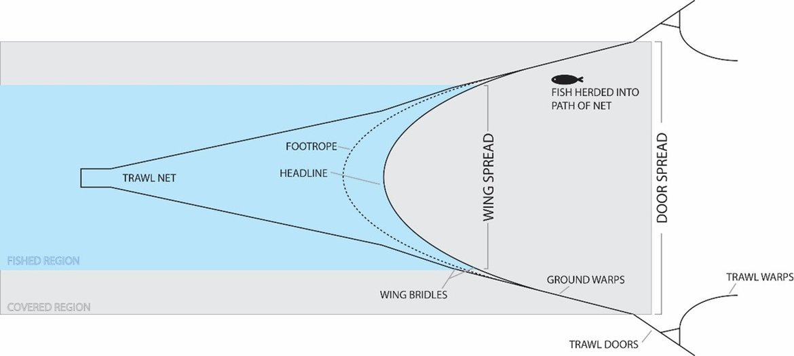
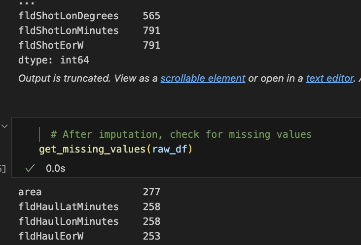
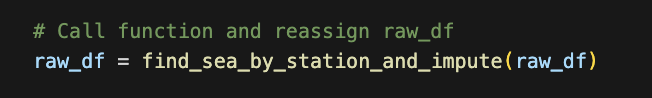
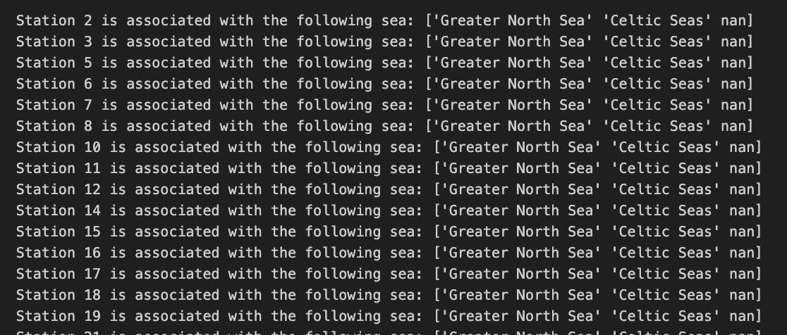
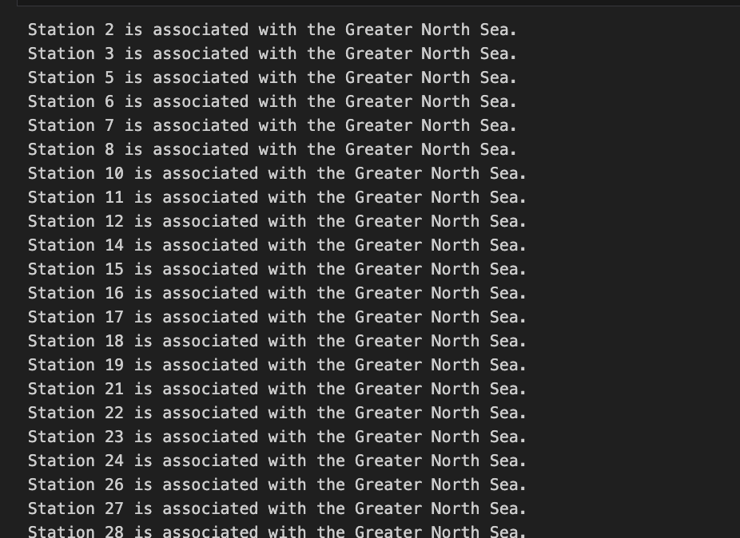
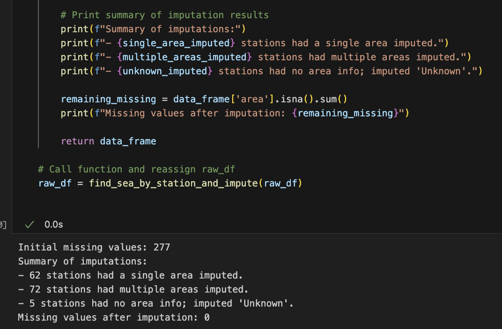
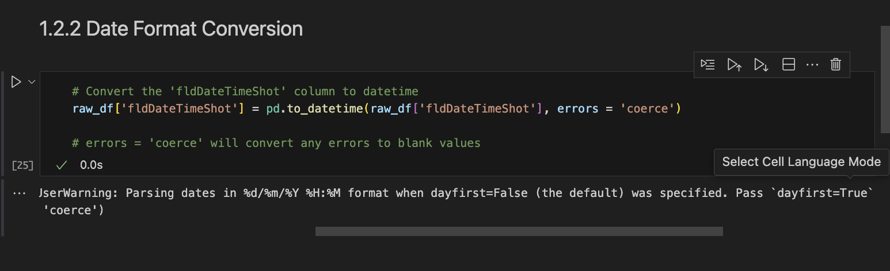

# North East Atlantic Seafloor Litter Analysis

## 📖 Table of Contents  
| **Section**                             | **Description**                          |
|-----------------------------------------|------------------------------------------|
| 🎯 [Introduction & Project Overview](#introduction-project-overview)  | Overview of the project and objectives.  |
| 📊 [Dataset](#dataset)                  | Information about the dataset used.      |
| 💼 [Business Requirements](#business-requirements) | Key business requirements for the project. |
| 🔎 [Hypotheses and Validation](#hypotheses-and-validation) | Hypotheses being tested and their validation. |
| 🧭 [Project Plan & Methodology](#project-plan-methodology) | Detailed methodology and steps for analysis. |
| 📈 [Data Analysis & Visualisation](#data-analysis-visualisation) | Approaches for data analysis and visualisation. |
| 🖥️ [Dashboard Design & Development](#dashboard-design-development) | Design and development of the dashboard. |
| 🧩 [Challenges, Solutions & Future Developments](#challenges-solutions-future-developments) | Challenges faced, solutions provided, and future directions. |
| 🐞 [Unfixed Bugs](#unfixed-bugs) | List of any unresolved bugs or issues. |
| 🤖 [Generative AI & Ethical Considerations](#generative-ai-ethical-considerations) | Ethical considerations and use of generative AI. |
|  [Evaluation](#evaluation) | Evaluation of project. |
| 🔗 [References](#references)               | List of references used in the project.  |

You can view the interactive dashboard here: [North East Atlantic Marine Litter Dashboard](https://public.tableau.com/app/profile/maha.hussain/viz/NorthEastAtlanticSeafloorLitterDashboard/Dashboard115)

##  🎯 Introduction & Project Overview

### Project Goal
This project aims to provide an in depth analysis into the distribution and composition of marine litter in the North East Atlantic region. Moreover, it serves to identify trends and potential strategies that can be enforced to mitigate marine pollution. 

### What is marine litter?
Marine litter is defined as non-organic waste that has been deliberately or accidentally released into the sea or ocean [[1]](#1). The definition encompasses debris such as plastic, metals, rubber and woods, among others.

### What issues arise due to marine litter?

The accumulation of non-organic waste in the seas leads to the pollution of our waters. Marine pollution is considered to be one of many critical global issues that not only poses a threat to our ecosystems, but also is detrimental to our human existence. For many people across the globe, the sea serves as a means of sustenance and a source of livelihood. Furthermore, the seas absorb carbon emissions, produce part of the oxygen we breathe, and intake excess heat from the climate system, as reported by the United Nations [[2]](#2). As marine pollution continues to increase, it jeopardises the sea's ability to perform these essential functions.

>According to UNESCO, **"by 2050, the weight of marine plastic waste could surpass the weight of all fish in the ocean if it is not controlled."** [[3]](#3)

## 📊 Dataset

The dataset used for this analysis is sourced from CEFAS (Centre for Environment, Fisheries, and Aquaculture Science) and includes public data from three significant marine surveys conducted between 1992 and 2015. [[4]](#4)

These surveys include:

1. **International Bottom Trawl Survey (IBTS)**
2. **ICES Ground Fish Surveys (Q4SW)**
3. **Clean Seas Environment Monitoring Programme (CSEMP)**

The dataset follows the classification system defined by Galgani et al. (2013), which provides a comprehensive framework for marine litter monitoring in European seas.

**Definition:**  
Public data – no limitations to public access.  

**Conditions for Reuse:**  
Public data – no limitations on reuse.  

The dataset includes a wide range of attributes related to seafloor litter, with data gathered from multiple research vessel (RV) cruises over a 22-year period. The data encompasses both the collection of different types of litter and the geographical and temporal details associated with each haul or station.

### Key Attributes of the Dataset:
- **Year**: Year of data collection
- **Survey Name**: The name of the survey (IBTS, Q4SW, CSEMP)
- **Cruise Name**: Name of the RV cruise
- **Area**: Geographical area surveyed (Greater North Sea/Celtic Sea)
- **Station Number**: Identification number for the station
- **Latitude and Longitude**: Coordinates of the haul and shot locations
- **Date**: Date of the data collection

### Types of Litter Categories:

#### **Plastic Litter**:
| Item                  | Description                |
|-----------------------|----------------------------|
| `bottle`              | Plastic bottles            |
| `sheet`               | Plastic sheeting           |
| `bag`                 | Plastic bags               |
| `caps`                | Plastic bottle caps        |
| `fishline.mono`       | Fishing line (monofilament)|
| `fishline.tang`       | Entangled fishing line     |
| `synthrope`           | Synthetic ropes            |
| `fishnet`             | Fishing nets               |
| `cabletie`            | Cable ties                 |
| `strap`               | Strapping bands            |
| `crates`              | Plastic crates             |
| `nappies`             | Plastic nappies            |
| `santowels`           | Sanitary towels            |
| `other.plas`          | Other plastic items        |

#### **Metal Litter**:
| Item                  | Description                |
|-----------------------|----------------------------|
| `cansfood`            | Metal food cans            |
| `cansdrink`           | Metal drink cans           |
| `fishmetal`           | Metal items related to fishing |
| `drums`               | Metal drums                |
| `appliance`           | Metal appliances           |
| `carparts`            | Car parts                  |
| `cables`              | Metal cables               |
| `other.metal`         | Other metal debris         |

#### **Rubber Litter**:
| Item                  | Description                |
|-----------------------|----------------------------|
| `wellies`             | Rubber boots               |
| `balloon`             | Rubber balloons            |
| `bobbins`             | Rubber bobbins             |
| `tyre`                | Car tyres                  |
| `gloves`              | Rubber gloves              |
| `other.rub`           | Other rubber items         |

#### **Glass Litter**:
| Item                  | Description                |
|-----------------------|----------------------------|
| `jars`                | Glass jars                 |
| `bottles`             | Glass bottles              |
| `pieces`              | Pieces of glass            |
| `other.glass`         | Other glass items          |

#### **Wood Litter**:
| Item                  | Description                |
|-----------------------|----------------------------|
| `woodnat`             | Natural wood               |
| `woodproc`            | Processed wood             |
| `rope`                | Natural rope               |
| `paper`               | Paper                      |
| `pallets`             | Wooden pallets             |
| `other.wood`          | Other wood items           |

#### **Clothing and Fabrics**:
| Item                  | Description                |
|-----------------------|----------------------------|
| `clothing`            | Clothing                   |
| `shoes`               | Shoes                      |

#### **Miscellaneous Litter**:
| Item                  | Description                |
|-----------------------|----------------------------|
| `other.misc`          | Miscellaneous items        |

### Counts, Trawl Distance & Wing Spread
- **Total Litter**: Total amount of litter identified during the survey
- **Distance Trawled**: The distance covered during the trawling process
- **Wing Spread**: The length of the net opening (in metres)

 
 

### Additional Data:
- In addition to the Cefas data, Global Fishing Watch data will be used to track commercial fishing activity and  its potential connection to marine litter. [[5]](#5) This will provide an additional layer of insight into the overlap between fishing activities and pollution hotspots.

## 💼 Business Requirements
The business requirements focus on identifying pollution hotspots, trends in litter composition, and evaluating the environmental impact of marine debris.

### Project Objectives
- Classify pollution: Categorise marine litter by type (plastics, metals, etc.).
- Analyse composition trends: Track temporal changes in litter composition over time.
- Identify hotspots: Locate pollution concentrations for targeted cleanup campaigns.
- Assess environmental impact: Evaluate the effects on marine biodiversity
- Public awareness: Present findings in an accessible and compelling format for non-technical audiences and stakeholders.

### Project Constraints
- Geographical Limitation: The analysis is limited to the North East Atlantic region, as per the available Cefas survey data. Data from other regions or outside the Cefas dataset will not be included, with the sole exception of Global Fishing Watch data for additional context.

- Temporal Scope: The dataset spans from 1992 to 2015, and any changes to the scope of this period will require additional data sources.

- Data Quality: The quality and consistency of data across different surveys and years may vary, which could affect the reliability of the analysis. Any gaps in the data will be addressed through interpolation or estimation where necessary.

### Project Stakeholders
#### Environmental agencies (Primary Stakeholder)
Organisations focused on monitoring, protecting, and managing the environment. They use data to track pollution, enforce regulations, and guide conservation efforts to protect natural resources and ecosystems.

- **Data Requirements:**
    - Visualise litter trends, hotspots, and environmental impact.
    - Monitor pollution levels over time.
    - Impact analysis on marine life.

- **Dashboard Features:**
    - Trend charts for litter types over time.
    - Heatmaps to identify pollution hotspots.

- **Desired Outcomes:**
    - Improve conservation efforts.
    - Reduce marine pollution.
    - Support environmental regulations.

### Project Intended Audiences
- **Environmental organisations & NGOs** – Use findings to advocate for stronger policies  
- **Students & educators** – Benefit from visualisations through learning and awareness  
- **Public & media** – Understand marine pollution trends through accessible insights  

## 🔎 Hypotheses and Validation
### Hypothesis 1: Plastic is increasing over time
- **Alternative Hypothesis (H₁):** The amount of plastic litter is increasing over time.
- **Null Hypothesis (H₀):** The amount of plastic litter is not increasing over time.
- **Rationale:**  
Studies and environmental reports suggest that plastic pollution has been rising over the years due to increased plastic production and inadequate waste management. This hypothesis aims to confirm whether the trend holds in the dataset over time.

Hannah Ritchie, Veronika Samborska, and Max Roser (2023) state that "Plastic production has sharply increased over the last 70 years. In 1950, the world produced just two million tonnes. It now produces over 450 million tonnes" (Our World in Data). This sharp rise in production suggests a likely increase in plastic pollution, which this analysis seeks to validate.

- **Exploratory Data Analysis (EDA) Approach:**  
  - Bar chart of plastic across years. 
  - Moving average plot.
- **Validation Method:**  
  - Linear regression – To test if the slope of plastic litter over time is significantly positive.
  Mann-Kendall trend test – To detect whether there is a consistent upward trend in plastic litter over time.

---

### Hypothesis 2: Litter accumulation varies significantly between the Celtic and Greater North Sea areas  
- **Alternative Hypothesis (H₁):** Litter accumulation varies significantly between these areas.  
- **Null Hypothesis (H₀):** There is no significant difference in litter accumulation between these areas.  
- **Rationale:**  
  Investigating whether litter accumulation differs between these two survey areas can help understand regional differences in pollution and support targeted intervention strategies.  
- **EDA Approach:**  
  - Grouped bar plots comparing `totallitter` between the Celtic and Greater North Sea areas  
  - Boxplots to compare the distribution of litter  
- **Validation Method:**  
  - Check if data is normally distributed using:  
    - Plot & Shapiro-Wilk test for normality  
  - If normal: **T-test**  
  - If not normal: **Mann-Whitney U test**  

---

### Hypothesis 3: There is a positive correlation between the distance of the haul and the total amount of litter found  
- **Alternative Hypothesis (H₁):** There is a positive correlation between the distance of the haul and the total amount of litter found.  
- **Null Hypothesis (H₀):** There is no correlation between the distance of the haul and the total amount of litter found.  
- **Rationale:**  
  Larger distances may lead to more litter being collected.  
- **EDA Approach:**  
  - Scatterplot: Distance vs. Total Litter  
- **Validation Method:**  
  - Pearson Correlation Coefficient  
  - T-test for statistical significance  

---

### Hypothesis 4: The proportion of fishing-related debris relative to other types of debris has increased over time, suggesting an increasing contribution from fishing activity.
- **Alternative Hypothesis (H₁):** The trend in fishing-related debris is significantly different from the trend in other types of debris over time.
- **Null Hypothesis (H₀):** The trend in fishing-related debris is not significantly different from the trend in other types of debris over time.
- **Rationale:**  
  The fishing industry contributes significantly to marine debris, especially plastics and fishing gear (nets, ropes, etc.). While it is known that marine debris originates from various sources (e.g., shipping, recreational activities, land-based pollution), identifying whether fishing activity contributes disproportionately to debris accumulation would help clarify the extent of its impact.  
- **EDA Approach:**  
  - Mapping of only fishing-related debris  
  - Comparison with global fishing watch activity data  
  - Line chart to compare fishing debris to other litter types.
- **Validation Method:**  
  - Linear regression
  - Mann-Kendall 

---
## 🧭 Project Plan & Methodology
### High-Level Steps
The analysis followed a structured approach, including:

1. **Data Collection** – The dataset was sourced from CEFAS in CSV format.  
2. **Data Cleaning & Preprocessing** – Steps included handling missing values, standardising column names, encoding categorical variables, and formatting date-time fields.  
3. **Exploratory Data Analysis (EDA)** – Conducted descriptive and inferential statistics, including summary statistics, outlier detection, and visualisations.  
4. **Data Categorisation & Feature Engineering** – Litter items were classified into distinct material categories for better analysis.  
5. **Data Storage & Export** – The cleaned dataset was saved as `02_PROCESSED_NEA-Seafloor-Litter.csv` for further use.  
6. **Analysis & Interpretation** – Trends in marine litter composition, geographical distribution, and seasonal variations were analysed.  

---

### Data Management
The project employed several best practices for data management:

- **Version Control:** GitHub was used to track changes and maintain version control.  
- **Data Storage:** Raw and processed data were saved in structured CSV formats (`01_RAW_NEA-Seafloor-Litter.csv` and `02_PROCESSED_NEA-Seafloor-Litter.csv`).  
- **Documentation:** The process was well-documented within Jupyter notebooks, including comments and function explanations.  
- **Handling Missing Data:** Missing values were identified and either imputed based on logical criteria or filled with placeholders (e.g., "Unknown").  
- **Normalisation & Structuring:** Data types were standardised (e.g., converting date fields to datetime format), and redundant fields were removed to ensure consistency.  

---

### Methodology Justification
The chosen methodologies aligned with the project goals in the following ways:

- **Data Collection Methodology:**  
  - CSV files were used as the primary data source, considering the historical nature of the data.  
  - The choice of CSV ensured easier data access and processing compared to API-based retrieval.  

- **Data Cleaning & Preprocessing:**  
  - Standard preprocessing steps (removing duplicates, handling missing values, encoding categorical variables) were applied to improve data quality.  
  - Outlier detection ensured anomalies did not distort analysis results.  

- **Data Analysis Techniques:**  
  - **Descriptive Statistics:** Used measures like mean, median, and standard deviation to understand data distributions.  
  - **Inferential Statistics:** Applied hypothesis testing and probability calculations to validate trends.  
  - **Visualisation:** Utilised histograms, boxplots, and correlation heatmaps to identify key insights.  

- **Why These Methods?**  
  - The chosen techniques ensured robust data integrity and meaningful insights.  
  - The combination of exploratory and inferential approaches allowed for both high-level trend identification and in-depth analysis.  

## 📈 Data Analysis & Visualisation

### Main Data Analysis Libraries
* **Pandas:** Used for data manipulation, cleaning, and preprocessing. For example, `df = pd.read_csv('01_RAW_NEA-Seafloor-Litter.csv')` to load the dataset and `df['Year'] = pd.to_datetime(df['Year'], format='%Y')` to convert the 'Year' column to datetime format.
* **NumPy:** Utilised for numerical operations, like calculating summary statistics and handling arrays. For example, `np.mean(df['TotalLitter'])` to calculate the mean of the 'TotalLitter' column.
* **Matplotlib & Seaborn:** Employed for data visualisation, creating charts like bar plots, scatter plots, and heatmaps. For example, `sns.barplot(x='Year', y='TotalLitter', data=df)` to visualise litter trends over time.
* **SciPy:** Used for statistical tests, such as t-tests and Mann-Whitney U tests. For example, `stats.ttest_ind(df1['TotalLitter'], df2['TotalLitter'])` to compare litter accumulation between two areas.
* **Statsmodels:** Used for linear regression and time series analysis. For example, `smf.ols('TotalLitter ~ Year', data=df).fit()` to perform linear regression.
* **Plotly:** Used for interactive visualisations, such as maps and dashboards. For example, `px.scatter_geo(df, lat='Latitude', lon='Longitude', color='TotalLitter')` to create a geographical scatter plot.

### Analysis techniques used
* **Descriptive Statistics:** Summary statistics (mean, median, standard deviation) were used to understand the distribution of litter data.
* **Inferential Statistics:** Hypothesis testing (t-tests, Mann-Whitney U tests, linear regression, Mann-Kendall trend test) was used to validate hypotheses about litter trends and distributions.
* **Data Visualisation:** Charts and plots (bar plots, scatter plots, heatmaps, box plots, geographical plots) were used to visualise litter data and identify patterns.
* **Feature Engineering:** New features were created (e.g., categorising litter types) to facilitate analysis.
* **Correlation Analysis:** Pearson correlation coefficient was used to identify relationships between variables.

**Limitations and Alternative Approaches:**
* **Data Quality:** The dataset had missing values and inconsistencies, which required imputation and preprocessing. Alternative approaches could include using more advanced imputation techniques or collecting additional data.
* **Temporal Scope:** The dataset only spanned from 1992 to 2015, limiting the ability to analyzs recent trends. Alternative approaches could include incorporating more recent data from other sources.

**Data Structure and Justification:**
* Data was structured into Pandas DataFrames, which allowed for efficient data manipulation and analysis.
* Data was categorised into litter types and geographical areas to facilitate comparative analysis.
* Data was aggregated and summarised to identify trends and patterns.

**Data Limitations and Alternative Approaches:**
* The dataset lacked information on the sources of litter, which limited the ability to identify the causes of pollution. Alternative approaches could include conducting source tracking studies or incorporating data on human activities.
* The dataset did not include information on the environmental impact of litter, which limited the ability to assess the ecological consequences of pollution. Alternative approaches could include conducting ecological surveys or incorporating data on marine biodiversity.

### Business Requirements and Mapped Visualisations

##  🖥️  Dashboard Design & Development
For a detailed report on the design process and the role of AI assistance, please check the following file:

[Enhancing Marine Litter Dashboard Design with AI Assistance.pdf](https://github.com/MahaSci/NEA-Seafloor-Litter-Analysis/blob/main/dashboard/Enhancing%20Marine%20Litter%20Dashboard%20Design%20with%20AI%20Assistance.pdf)
## 🧩 Challenges, Solutions & Future Developments

### Challenges & Solutions
What challenges did you face, and what strategies were used to overcome these challenges?

-10.2 Reflect on the practical challenges and considerations in executing the project: 
In the notebook, learners should reflect on challenges like dataset size or deployment issues and discuss potential solutions.

During the development of this project, I encountered a few challenges:

1.  **DataFrame Not Updating:**
    * Initially, I noticed that the DataFrame (`df`) was not being updated as expected after performing certain operations.
    * I remembered that in Pandas, many DataFrame operations return a new DataFrame rather than modifying the original one in place.
    * To fix this, I made sure to reassign the result of each operation back to the `df` variable (e.g., `df = df.dropna()`).

 

2.  **Imputation Function and Missing Values:**
    * After applying the imputation function (to fill in missing sea names), the function to check for missing values still showed 277 missing areas.
    * 

    * This was because I forgot to reassign the DataFrame after the imputation.
    * 
    * Reassigning `raw_df` to `find_sea_by_station_and_impute(raw_df)` fixed this issue.

 

3.  **Long Output from Imputation Function:**
    * The initial output from the imputation function was very long (277 lines) and contained a messy list of associated seas.
    * 
    * To make it easier to understand, I used ChatGPT to summarise the output.

    * First, I changed the output to just print the seas that were associated with each station.
    * 
    * Then, I asked it to provide a summary of the number of imputations for each category (stations with one associated area, multiple areas, or unknown).

    * The final output showed the initial 277 missing values, a summary of the imputations (e.g., "X stations had a single area imputed"), and then 0 missing values after imputation.
    * 
    * This made the output much more manageable and easier to review.
 

4.  **Date Parsing Error:**
    * I encountered a date parsing error because the date format was not being correctly interpreted.
    * 
    * I fixed this by adding `dayfirst=True` to the `pd.to_datetime()` function, as recommended by the error message.

### Future Developments
* What new skills or tools do you plan to learn next based on your project experience? 

* **Data Updates:** Implement a system to regularly update the dataset with new data from CEFAS and other sources.
* **Model Retraining:** Retrain the models used in the analysis with updated data to improve accuracy and identify new trends.
* **Dashboard Enhancements:** Add new features to the dashboard, such as interactive maps, more detailed visualisations, and the ability to download data.
* **Predictive Modeling:** Develop predictive models to forecast future litter accumulation and identify potential hotspots.
* **Environmental Impact Assessment:** Incorporate data on marine biodiversity and ecosystem health to assess the environmental impact of litter.
* **Source Tracking:** Conduct source tracking studies to identify the origins of litter and develop targeted interventions.
* **Integration of Global Fishing Watch Data:** Further integrate the Global Fishing Watch data to better understand the relationship between fishing activity and marine litter.
* **Deployment:** Deploy the dashboard as a web application for wider accessibility.
* **Improved User Interface:** Enhance the user interface based on user feedback to improve usability and accessibility.
* **Advanced statistical methods:** Implement more complex statistical methods, such as spatial statistics, to gain deeper insights into the data.
* **Machine Learning:** Explore the use of machine learning algorithms to automate the identification of litter types or predict litter accumulation.
* **Learning new tools:** Learn more about advanced data visualisation tools such as D3.js, or geospatial analysis libraries like GeoPandas.

## 🐞 Unfixed Bugs
* **Spatial Data Accuracy:** The 'Latitude' and 'Longitude' data points were not always precise, leading to minor inaccuracies in geographical visualizations. Improvements could be made by cross-referencing with more accurate spatial databases, but this was not implemented due to resource limitations.
* **Wing Spread Data Issues:** Wing spread data had some issues, as noted by the International Bottom Trawl Survey Working Group (IBTSWG) . This could lead to some inaccuracies in the analysis relating to the density of litter. Due to the complexity of correcting this data, and the fact that the data was from an official source, this was not changed.

* Did you recognise gaps in your knowledge, and how did you address them?
* **Statistical Analysis:** Prior to the bootcamp, I had limited experience with advanced statistical tests. The lessons taught helped immensely, and I sought external resources such as AI and DataCamp.
* **Data Visualisation:** I was unfamiliar with some advanced data visualisation techniques, such as creating interactive maps and heatmaps. I addressed this by exploring the documentation and examples of Plotly and other visualisation libraries.
* **Geospatial analysis:** While I could plot latitude and longitude, more complex analysis such as calculating distances, or area calculations were outside of my current skillset, and would be something I would like to explore in the future.
* **Correlation analysis:** I initially was unaware how to select the best correlation methods. I learned about Cramér's V and other methods for categorical data. I also learned how to hide the upper half of a scatterplot matrix using Plotly express.

## 🤖 Generative AI & Ethical Considerations
Please view the [GEN_AI.md](reports/GEN_AI.md) & [ETHICS.md](reports/ETHICS.md)

##  Evaluation
Please view the [EVALUATION.md](reports/Evaluation.md)

##  🔗 References 
<a id="1">[1]</a> 
*   Wikipedia Contributors. (2025, January 23). Marine debris. In *Wikipedia, The Free Encyclopedia*. 
Retrieved March 11, 2025, from [https://en.wikipedia.org/w/index.php?title=Marine_debris&oldid=1271267612](https://en.wikipedia.org/w/index.php?title=Marine_debris&oldid=1271267612)

<a id="2">[2]</a>
*   United Nations. (2025). 5 Reasons You Should Care About Our Ocean. Retrieved March 11, 2025, from [https://www.un.org/en/desa/5-reasons-you-should-care-about-our-ocean](https://www.un.org/en/desa/5-reasons-you-should-care-about-our-ocean)

<a id="3">[3]</a>
*   UNESCO. (2025). Plastic Pollution in the Ocean. Retrieved March 11, 2025, from [https://oceanliteracy.unesco.org/plastic-pollution-ocean/](https://oceanliteracy.unesco.org/plastic-pollution-ocean/)

<a id="5">[5]</a> 
*   Global Fishing Watch. (2025). Retrieved from [https://globalfishingwatch.org/](https://globalfishingwatch.org/)

* [6] International Bottom Trawl Survey Working Group (IBTSWG). (2021). Wing Spread Data Issues in International Surveys. Retrieved from https://literatur.thuenen.de/digbib_extern/dn064116.pdf

* [7] DataCamp. (n.d.). Univariate Investment Risk and Returns: Introduction to Portfolio Risk Management in Python. Retrieved from https://campus.datacamp.com/courses/introduction-to-portfolio-risk-management-in-python/univariate-investment-risk-and-returns?ex=12

* [8] DataCamp. (n.d.). Analyzing Survey Data in Python: Statistical Modeling. Retrieved from https://campus.datacamp.com/courses/analyzing-survey-data-in-python/statistical-modeling?ex=8.

* [9] IBM. (n.d.). Cramér's V Definition. Retrieved from https://www.ibm.com/docs/en/cognos-analytics/11.1.0?topic=terms-cramrs-v.

* [10] Plotly Community. (n.d.). Plotly Express Scatter Matrix: Hide Upper Half and Diagonal. Retrieved from https://community.plotly.com/t/plotly-express-scatter-matrix-hide-upper-half-and-diagonal/69812

* [11] H. Ritchie, V. Samborska, and M. Roser. (2023). Plastic Pollution. Published online at OurWorldinData.org. Retrieved from https://ourworldindata.org/plastic-pollution

## Acknowledgements (optional)
* Thank the people who provided support through this project.