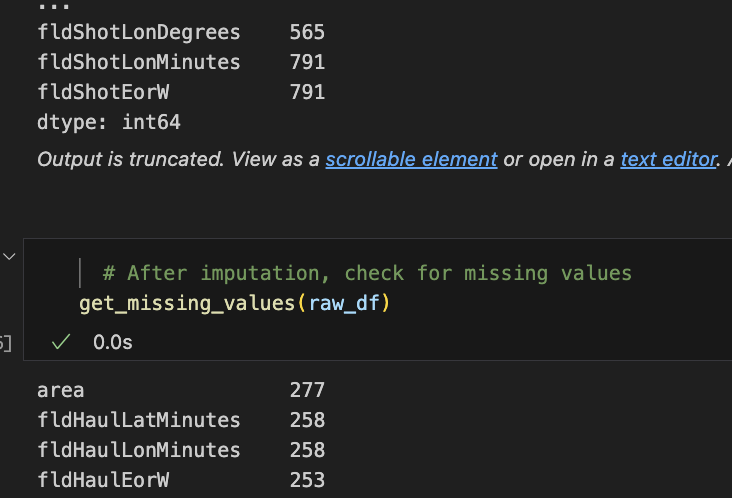
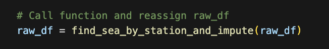
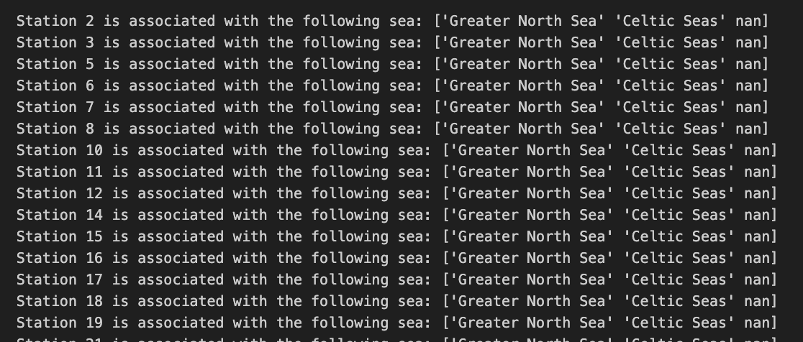
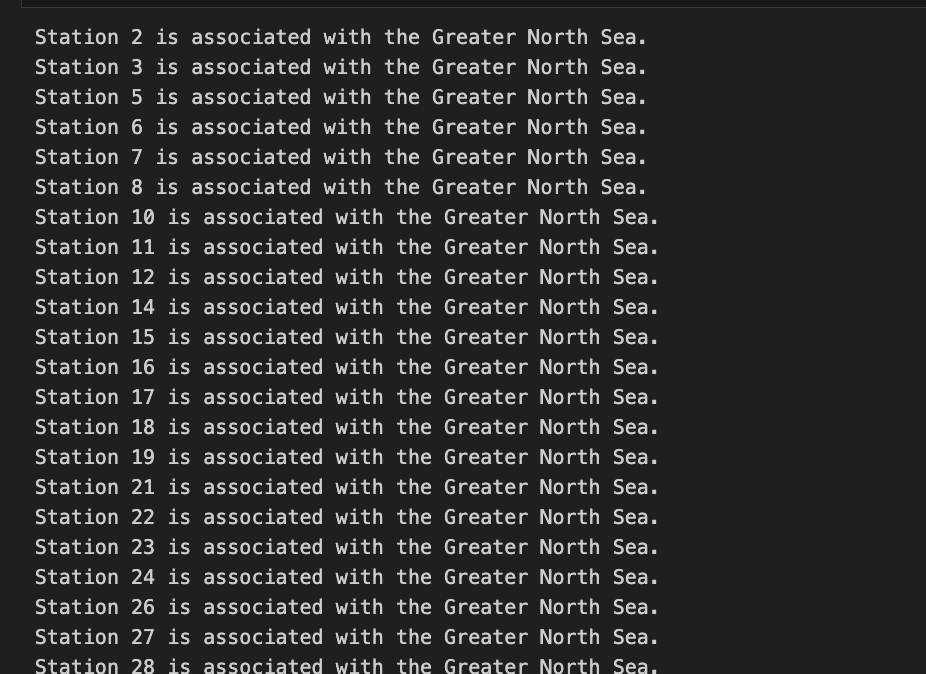
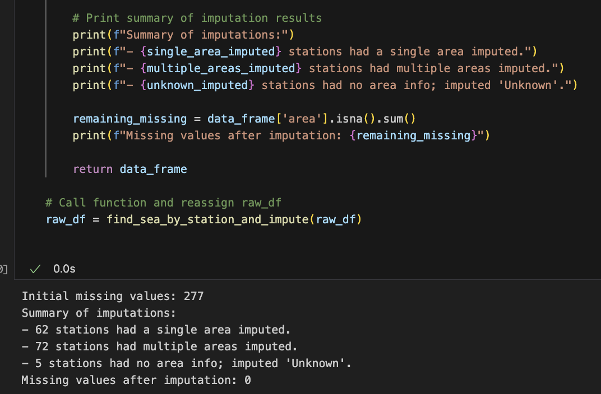
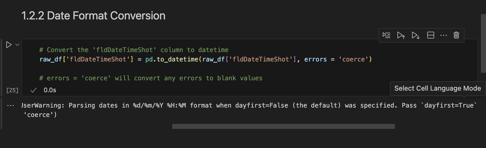

# North East Atlantic Seafloor Litter Analysis

## 📖 Table of Contents  
| **Section**                             | **Description**                          |
|-----------------------------------------|------------------------------------------|
| 🎯 [Introduction & Project Overview](#introduction-project-overview)  | Overview of the project and objectives.  |
| 📊 [Dataset](#dataset)                  | Information about the dataset used.      |
| 💼 [Business Requirements](#business-requirements) | Key business requirements for the project. |
| 🔎 [Hypotheses and Validation](#hypotheses-and-validation) | Hypotheses being tested and their validation. |
| 🧭 [Project Plan & Methodology](#project-plan-methodology) | Detailed methodology and steps for analysis. |
| 📈 [Data Analysis & Visualisation](#data-analysis-visualisation) | Approaches for data analysis and visualisation. |
| 🖥️ [Dashboard Design & Development](#dashboard-design-development) | Design and development of the dashboard. |
| 🧩 [Challenges, Solutions & Future Developments](#challenges-solutions-future-developments) | Challenges faced, solutions provided, and future directions. |
| 🐞 [Unfixed Bugs](#unfixed-bugs) | List of any unresolved bugs or issues. |
| 🤖 [Generative AI & Ethical Considerations](#generative-ai-ethical-considerations) | Ethical considerations and use of generative AI. |
| 🎖️ [Credits](#credits)                     | Acknowledgments and credits.             |
| 🔗 [References](#references)               | List of references used in the project.  |

##  🎯 Introduction & Project Overview

### Project Goal
This project aims to provide an in depth analysis into the distribution and composition of marine litter in the North East Atlantic region. Moreover, it serves to identify trends and potential strategies that can be enforced to mitigate marine pollution. 

### What is marine litter?
Marine litter is defined as non-organic waste that has been deliberately or accidentally released into the sea or ocean [[1]](#1). The definition encompasses debris such as plastic, metals, rubber and woods, among others.

### What issues arise due to marine litter?

The accumulation of non-organic waste in the seas leads to the pollution of our waters. Marine pollution is considered to be one of many critical global issues that not only poses a threat to our ecosystems, but also is detrimental to our human existence. For many people across the globe, the sea serves as a means of sustenance and a source of livelihood. Furthermore, the seas absorb carbon emissions, produce part of the oxygen we breathe, and intake excess heat from the climate system, as reported by the United Nations [[2]](#2). As marine pollution continues to increase, it jeopardises the sea's ability to perform these essential functions.

>According to UNESCO, **"by 2050, the weight of marine plastic waste could surpass the weight of all fish in the ocean if it is not controlled."** [[3]](#3)

## 📊 Dataset

The dataset used for this analysis is sourced from CEFAS (Centre for Environment, Fisheries, and Aquaculture Science) and includes public data from three significant marine surveys conducted between 1992 and 2014. [[4]](#4)

These surveys include:

1. **International Bottom Trawl Survey (IBTS)**
2. **ICES Ground Fish Surveys (Q4SW)**
3. **Clean Seas Environment Monitoring Programme (CSEMP)**

The dataset follows the classification system defined by Galgani et al. (2013), which provides a comprehensive framework for marine litter monitoring in European seas.

**Definition:**  
Public data – no limitations to public access.  

**Conditions for Reuse:**  
Public data – no limitations on reuse.  

The dataset includes a wide range of attributes related to seafloor litter, with data gathered from multiple research vessel (RV) cruises over a 22-year period. The data encompasses both the collection of different types of litter and the geographical and temporal details associated with each haul or station.

### Key Attributes of the Dataset:
- **Year**: Year of data collection
- **Survey Name**: The name of the survey (IBTS, Q4SW, CSEMP)
- **Cruise Name**: Name of the RV cruise
- **Area**: Geographical area surveyed (Greater North Sea/Celtic Sea)
- **Station Number**: Identification number for the station
- **Latitude and Longitude**: Coordinates of the haul and shot locations
- **Date**: Date of the data collection

### Types of Litter Categories:

#### **Plastic Litter**:
| Item                  | Description                |
|-----------------------|----------------------------|
| `bottle`              | Plastic bottles            |
| `sheet`               | Plastic sheeting           |
| `bag`                 | Plastic bags               |
| `caps`                | Plastic bottle caps        |
| `fishline.mono`       | Fishing line (monofilament)|
| `fishline.tang`       | Entangled fishing line     |
| `synthrope`           | Synthetic ropes            |
| `fishnet`             | Fishing nets               |
| `cabletie`            | Cable ties                 |
| `strap`               | Strapping bands            |
| `crates`              | Plastic crates             |
| `nappies`             | Plastic nappies            |
| `santowels`           | Sanitary towels            |
| `other.plas`          | Other plastic items        |

#### **Metal Litter**:
| Item                  | Description                |
|-----------------------|----------------------------|
| `cansfood`            | Metal food cans            |
| `cansdrink`           | Metal drink cans           |
| `fishmetal`           | Metal items related to fishing |
| `drums`               | Metal drums                |
| `appliance`           | Metal appliances           |
| `carparts`            | Car parts                  |
| `cables`              | Metal cables               |
| `other.metal`         | Other metal debris         |

#### **Rubber Litter**:
| Item                  | Description                |
|-----------------------|----------------------------|
| `wellies`             | Rubber boots               |
| `balloon`             | Rubber balloons            |
| `bobbins`             | Rubber bobbins             |
| `tyre`                | Car tyres                  |
| `gloves`              | Rubber gloves              |
| `other.rub`           | Other rubber items         |

#### **Glass Litter**:
| Item                  | Description                |
|-----------------------|----------------------------|
| `jars`                | Glass jars                 |
| `bottles`             | Glass bottles              |
| `pieces`              | Pieces of glass            |
| `other.glass`         | Other glass items          |

#### **Wood Litter**:
| Item                  | Description                |
|-----------------------|----------------------------|
| `woodnat`             | Natural wood               |
| `woodproc`            | Processed wood             |
| `rope`                | Natural rope               |
| `paper`               | Paper                      |
| `pallets`             | Wooden pallets             |
| `other.wood`          | Other wood items           |

#### **Clothing and Fabrics**:
| Item                  | Description                |
|-----------------------|----------------------------|
| `clothing`            | Clothing                   |
| `shoes`               | Shoes                      |

#### **Miscellaneous Litter**:
| Item                  | Description                |
|-----------------------|----------------------------|
| `other.misc`          | Miscellaneous items        |

### Counts, Trawl Distance & Wing Spread
- **Total Litter**: Total amount of litter identified during the survey
- **Distance Trawled**: The distance covered during the trawling process
- **Wing Spread**: The spread of the trawl during data collection

This rich dataset provides a comprehensive view of marine pollution over an extensive period, offering insights into the types, distribution, and concentration of marine litter across the North East Atlantic.

### Additional Data:
- In addition to the Cefas data, Global Fishing Watch data will be used to track commercial fishing activity and  its potential connection to marine litter. [[5]](#5) This will provide an additional layer of insight into the overlap between fishing activities and pollution hotspots.

## 💼 Business Requirements
The business requirements focus on identifying pollution hotspots, trends in litter composition, and evaluating the environmental impact of marine debris.

### Project Objectives
- Classify pollution: Categorise marine litter by type (plastics, metals, etc.).
- Analyse composition trends: Track temporal changes in litter composition over time.
- Identify hotspots: Locate pollution concentrations for targeted cleanup campaigns.
- Assess environmental impact: Evaluate the effects on marine biodiversity
- Public awareness: Present findings in an accessible and compelling format for non-technical audiences and stakeholders.

### Project Constraints
- Geographical Limitation: The analysis is limited to the North East Atlantic region, as per the available Cefas survey data. Data from other regions or outside the Cefas dataset will not be included, with the sole exception of Global Fishing Watch data for additional context.

- Temporal Scope: The dataset spans from 1992 to 2014, and any changes to the scope of this period will require additional data sources.

- Data Quality: The quality and consistency of data across different surveys and years may vary, which could affect the reliability of the analysis. Any gaps in the data will be addressed through interpolation or estimation where necessary.

### Project Stakeholders
#### Environmental agencies (Primary Stakeholder)
Organisations focused on monitoring, protecting, and managing the environment. They use data to track pollution, enforce regulations, and guide conservation efforts to protect natural resources and ecosystems.

- **Data Requirements:**
    - Visualise litter trends, hotspots, and environmental impact.
    - Monitor pollution levels over time.
    - Impact analysis on marine life.

- **Dashboard Features:**
    - Trend charts for litter types over time.
    - Heatmaps to identify pollution hotspots.

- **Desired Outcomes:**
    - Improve conservation efforts.
    - Reduce marine pollution.
    - Support environmental regulations.

### Project Intended Audiences
- **Environmental organisations & NGOs** – Use findings to advocate for stronger policies  
- **Students & educators** – Benefit from visualisations through learning and awareness  
- **Public & media** – Understand marine pollution trends through accessible insights  

## 🔎 Hypotheses and Validation
### Hypothesis 1: Plastic is the highest category of litter  
- **Alternative Hypothesis (H₁):** Plastic is the highest category of litter.  
- **Null Hypothesis (H₀):** The plastic category is not the highest category of litter.  
- **Rationale:**  
  Plastic waste often makes up a large portion of marine pollution, based on existing studies and real-world observations. The hypothesis is that plastic is the dominant form of waste in the dataset.  
- **Exploratory Data Analysis (EDA) Approach:**  
  - Polar chart  
  - Histogram of categories over time  
  - Line chart comparing plastic vs. other materials  
- **Validation Method:**  
  - Chi-Square test to compare observed vs. expected category distributions  

---

### Hypothesis 2: Litter accumulation varies significantly between the Celtic and Greater North Sea areas  
- **Alternative Hypothesis (H₁):** Litter accumulation varies significantly between these areas.  
- **Null Hypothesis (H₀):** There is no significant difference in litter accumulation between these areas.  
- **Rationale:**  
  Investigating whether litter accumulation differs between these two survey areas can help understand regional differences in pollution and support targeted intervention strategies.  
- **EDA Approach:**  
  - Grouped bar plots comparing `totallitter` between the Celtic and Greater North Sea areas  
  - Boxplots to compare the distribution of litter  
- **Validation Method:**  
  - Check if data is normally distributed using:  
    - Plot & Shapiro-Wilk test for normality  
  - If normal: **T-test**  
  - If not normal: **Mann-Whitney U test**  

---

### Hypothesis 3: There is a positive correlation between the distance of the haul and the total amount of litter found  
- **Alternative Hypothesis (H₁):** There is a positive correlation between the distance of the haul and the total amount of litter found.  
- **Null Hypothesis (H₀):** There is no correlation between the distance of the haul and the total amount of litter found.  
- **Rationale:**  
  Larger distances may lead to more litter being collected.  
- **EDA Approach:**  
  - Scatterplot: Distance vs. Total Litter  
- **Validation Method:**  
  - Pearson Correlation Coefficient  
  - T-test for statistical significance  

---

### Hypothesis 4: There is a seasonal variation in the types of litter found (e.g., more plastic in summer months)  
- **Alternative Hypothesis (H₁):** There is a seasonal variation in the types of litter found.  
- **Null Hypothesis (H₀):** There is no seasonal variation in the types of litter found across different months of the year.  
- **Rationale:**  
  Seasonal variations in weather, human activity, and maritime traffic could influence the types of litter found.  
- **EDA Approach:**  
  - Bar chart of total litter across months, then grouped into seasons  
  - Breakdown of litter categories by season  
- **Validation Method:**  
  - **ANOVA** test to check for significant seasonal variation  

---

### Hypothesis 5: Coastal areas with higher fishing activity have higher amounts of fishing-related debris (2012-2015)  
- **Alternative Hypothesis (H₁):** Coastal areas with higher fishing activity have higher amounts of fishing-related debris.  
- **Null Hypothesis (H₀):** Coastal areas with higher fishing activity do not have higher amounts of fishing-related debris.  
- **Rationale:**  
  The fishing industry contributes significantly to marine debris, especially plastics and fishing gear (nets, ropes, etc.). This hypothesis tests whether higher fishing activity correlates with more debris.  
- **EDA Approach:**  
  - Heatmap of only fishing-related goods  
  - Overlay with fishing activity data  
- **Validation Method:**  
  - **For 2012-2015:** Fishing effort data can be confidently compared with marine debris data from the same period.  
  - **For 1992-2011:** While direct comparison with fishing data is not possible, debris trends over time can still be analysed. It is possible to hypothesise that earlier fishing efforts might have had similar patterns to the 2012-2015 period, depending on historical context.  

---
## 🧭 Project Plan & Methodology

### High-Level Steps:
* Outline the high-level steps taken for the analysis.
### Data Cleaning & Preprocessing
- **Data Import & Inspection:** Loaded `01_RAW_NEA-Seafloor-Litter.csv`, checked structure, and identified issues.
- **Handling Missing Values:** Applied imputation, removal, or "unknown" categorisation.
- **Standardisation & Formatting:** Reformatted dates, verified categorical consistency.
- **Filtering & Structuring:** Removed redundant records and prepared data for analysis.
- **Feature Engineering:** Created derived variables and normalised where necessary.
- **Output:** Saved cleaned data as `02_PROCESSED_NEA-Seafloor-Litter.csv`.

### Data Management:
* How was the data managed throughout the collection, processing, analysis and interpretation steps?

### Methodology Justification:
* Why did you choose the research methodologies you used?

## 📈 Data Analysis & Visualisation

### Main Data Analysis Libraries
* Here you should list the libraries you used in the project and provide an example(s) of how you used these libraries.

* List your business requirements and a rationale to map them to the Data Visualisations
##TODO: ADD TABLE W/ BIZ REQ, RATIONALE AND MAPPED VISUALISATION AND SECTION

### Analysis techniques used
* List the data analysis methods used and explain limitations or alternative approaches.
* How did you structure the data analysis techniques. Justify your response.
* Did the data limit you, and did you use an alternative approach to meet these challenges?

##  🖥️  Dashboard Design & Development
* List all dashboard pages and their content, either blocks of information or widgets, like buttons, checkboxes, images, or any other item that your dashboard library supports.
* Later, during the project development, you may revisit your dashboard plan to update a given feature (for example, at the beginning of the project you were confident you would use a given plot to display an insight but subsequently you used another plot type).
* How were data insights communicated to technical and non-technical audiences?
* Explain how the dashboard was designed to communicate complex data insights to different audiences. 

## 🧩 Challenges, Solutions & Future Developments

### Challenges & Solutions
What challenges did you face, and what strategies were used to overcome these challenges?
During the development of this project, I encountered a few challenges:

1.  **DataFrame Not Updating:**
    * Initially, I noticed that the DataFrame (`df`) was not being updated as expected after performing certain operations.
    * I remembered that in Pandas, many DataFrame operations return a new DataFrame rather than modifying the original one in place.
    * To fix this, I made sure to reassign the result of each operation back to the `df` variable (e.g., `df = df.dropna()`).

 

2.  **Imputation Function and Missing Values:**
    * After applying the imputation function (to fill in missing sea names), the function to check for missing values still showed 277 missing areas.
    * 

    * This was because I forgot to reassign the DataFrame after the imputation.
    * 
    * Reassigning `raw_df` to `find_sea_by_station_and_impute(raw_df)` fixed this issue.

 

3.  **Long Output from Imputation Function:**
    * The initial output from the imputation function was very long (277 lines) and contained a messy list of associated seas.
    * 
    * To make it easier to understand, I used ChatGPT to summarise the output.

    * First, I changed the output to just print the seas that were associated with each station.
    * 
    * Then, I asked it to provide a summary of the number of imputations for each category (stations with one associated area, multiple areas, or unknown).

    * The final output showed the initial 277 missing values, a summary of the imputations (e.g., "X stations had a single area imputed"), and then 0 missing values after imputation.
    * 
    * This made the output much more manageable and easier to review.
 

4.  **Date Parsing Error:**
    * I encountered a date parsing error because the date format was not being correctly interpreted.
    * 
    * I fixed this by adding `dayfirst=True` to the `pd.to_datetime()` function, as recommended by the error message.

### Future Developments
* What new skills or tools do you plan to learn next based on your project experience? 

## 🐞 Unfixed Bugs
* Please mention unfixed bugs and why they were not fixed. This section should include shortcomings of the frameworks or technologies used. Although time can be a significant variable to consider, paucity of time and difficulty understanding implementation are not valid reasons to leave bugs unfixed.
* Did you recognise gaps in your knowledge, and how did you address them?
* If applicable, include evidence of feedback received (from peers or instructors) and how it improved your approach or understanding.

## 🤖 Generative AI & Ethical Considerations
Please view the [GEN_AI.md](GEN_AI.md) & [ETHICS.md](ETHICS.md)

##  🎖️ Credits 

##  🔗 References 
<a id="1">[1]</a> 
*   Wikipedia Contributors. (2025, January 23). Marine debris. In *Wikipedia, The Free Encyclopedia*. 
Retrieved March 11, 2025, from [https://en.wikipedia.org/w/index.php?title=Marine_debris&oldid=1271267612](https://en.wikipedia.org/w/index.php?title=Marine_debris&oldid=1271267612)

<a id="2">[2]</a>
*   United Nations. (2025). 5 Reasons You Should Care About Our Ocean. Retrieved March 11, 2025, from [https://www.un.org/en/desa/5-reasons-you-should-care-about-our-ocean](https://www.un.org/en/desa/5-reasons-you-should-care-about-our-ocean)

<a id="3">[3]</a>
*   UNESCO. (2025). Plastic Pollution in the Ocean. Retrieved March 11, 2025, from [https://oceanliteracy.unesco.org/plastic-pollution-ocean/](https://oceanliteracy.unesco.org/plastic-pollution-ocean/)

<a id="5">[5]</a> 
*   Global Fishing Watch. (2025). Retrieved from [https://globalfishingwatch.org/](https://globalfishingwatch.org/)

### Media

- The photos used on the home and sign-up page are from This Open-Source site
- The images used for the gallery page were taken from this other open-source site

## Acknowledgements (optional)
* Thank the people who provided support through this project.